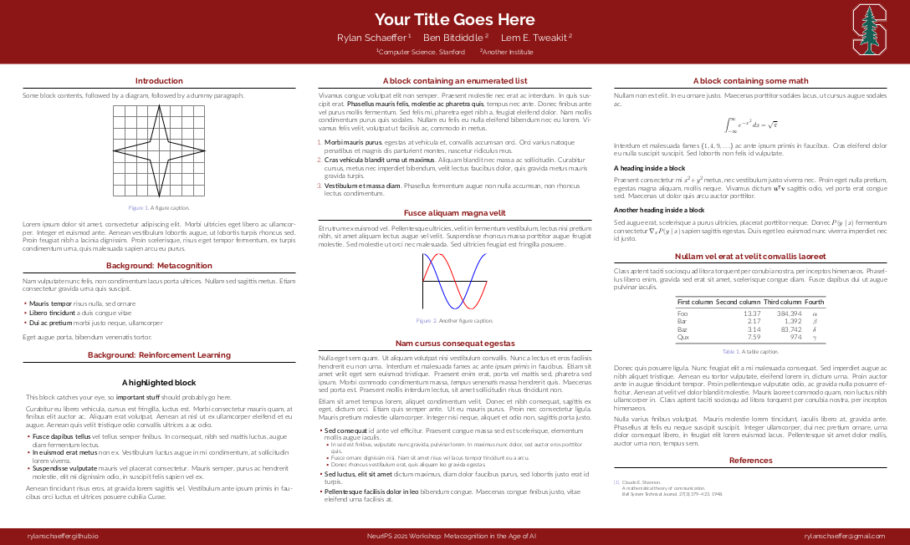

# Stanford LaTeX Poster Template

## 4 Available Colors

There are 4 available colors (see `demos/`): Palo Alto Green, Cardinal Red:

  
  

White, Cool Grey:

  
  

To change the color, go to `beamerthemestanford.sty` and change the `headline` color by (un)commenting the [relevant lines](https://github.com/RylanSchaeffer/Stanford-LaTeX-Poster-Template/blob/master/beamercolorthemestanford.sty#L44-L47):

- White Text, Palo Alto Green Banner: `\setbeamercolor{headline}{bg=paloaltogreen,fg=white}`
- Cardinal Red Text, White Banner: `\setbeamercolor{headline}{bg=white,fg=cardinalred}`
- White Text, Cardinal Red Banner: `\setbeamercolor{headline}{bg=cardinalred,fg=white}`
- White Text, Cool Gray Banner: `\setbeamercolor{headline}{bg=coolgray,fg=white}`

## Contributing

Contributions are more than welcome! If you have a way to improve this poster, please pay it forward by opening a pull request and I'll add your improvement(s)

Thank you in advance :)
